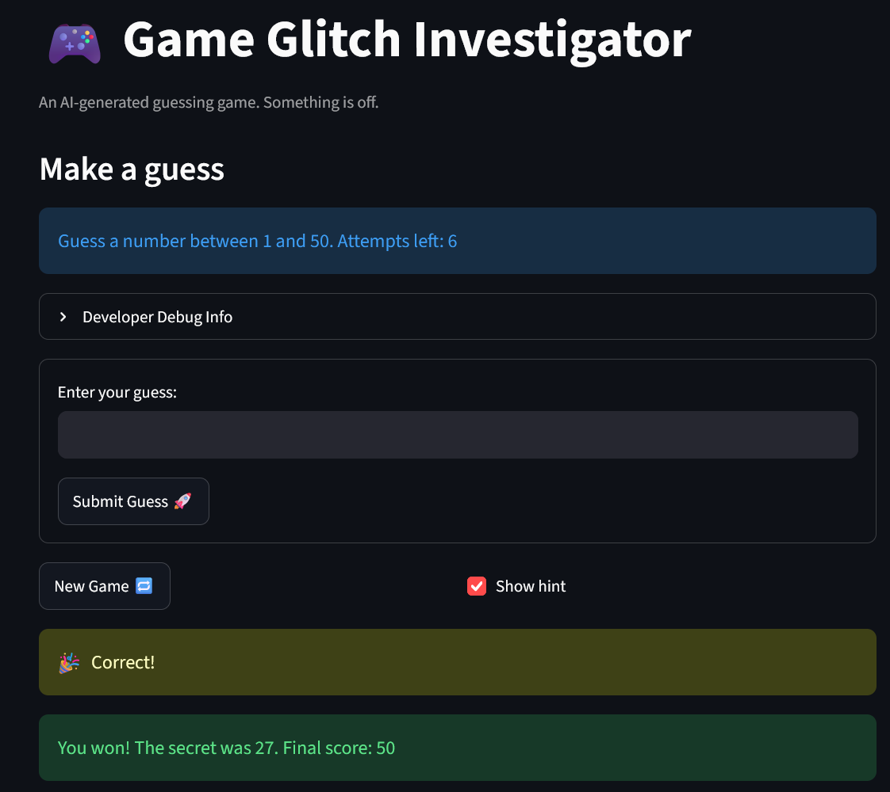

# 🎮 Game Glitch Investigator: The Impossible Guesser

## 🚨 The Situation

You asked an AI to build a simple "Number Guessing Game" using Streamlit.
It wrote the code, ran away, and now the game is unplayable. 

- You can't win.
- The hints lie to you.
- The secret number seems to have commitment issues.

## 🛠️ Setup

1. Install dependencies: `pip install -r requirements.txt`
2. Run the broken app: `python -m streamlit run app.py`

## 🕵️‍♂️ Your Mission

1. **Play the game.** Open the "Developer Debug Info" tab in the app to see the secret number. Try to win.
2. **Find the State Bug.** Why does the secret number change every time you click "Submit"? Ask ChatGPT: *"How do I keep a variable from resetting in Streamlit when I click a button?"*
3. **Fix the Logic.** The hints ("Higher/Lower") are wrong. Fix them.
4. **Refactor & Test.** - Move the logic into `logic_utils.py`.
   - Run `pytest` in your terminal.
   - Keep fixing until all tests pass!

## 📝 Document Your Experience

[ ] Describe the game's purpose.

The game's purpose is to help new AI engineers understand how to identify, understand, describe, fix, and test bugs. It is a simple guessing game that asks the player to guess a number between one and an upper bound number depending on the difficulty setting. However, it is full of glitches that ruin the gaming experience but serve as an excellent learning tool for burgeoning AI developers.

[ ] Detail which bugs you found.

There were many bugs in this game including but not limited to:

   - Incorrect hints that point in the wrong direction e.g., lower when it should be a higher guess
   - Incorrect guess attempt tracking where it starts at one attempt before any guesses are made
   - Inconsistent scoring where wrong guesses sometimes decrease your overall scores and sometimes increase it incorrectly
   - Reversed game difficulty logic where the hard setting had a lower range than normal which should be easier
   - Clicking on "New Game" did not actually reset the session state and start a new game
   - The UI hardcoded the guessing range of numbers instead of pulling in variables depending on the difficulty, e.g., normal should be 1 and 50 instead of 1 and 100
   - Pressing the enter button after inputting a guess did not actually register other than increasing the attempt

[ ] Explain what fixes you applied.

The below fixes targeted the previously mentioned bugs. All fixes were tested manually and using automated test cases.

   - Refactored all the core logic functions that had bugs such as `get_range_for_difficulty`, `check_guess`, and `update_score` and moved them out of `app.py` into `logic_utils.py`
   - Updated `app.py`'s streamlit parameters/components to use variables in the caption, set the attempts to start at 0, and reset the session status to playing to reflect the correct state
   - Adjusted the new game logic in `app.py` to reset the session score and history when new game is selected
   - Moved the developer debug info and function around in `app.py` to ensure that the attempts, score, and guess list match the user's actions

## 📸 Demo Walkthrough

Describe your fixed game in numbered steps so a reader can follow along without watching a video:

1. User starts the game on Normal difficulty
2. User enters a guess of 20
3. Game returns "Go HIGHER!" message
4. User enters 35
5. Game returns "Go LOWER!" message
6. User enters 27
7. Game returns "You won! The secret was 27. Final score: 50"

**Screenshot** *(optional)*:  




## 🧪 Test Results

```
# Paste your pytest output here

======================== test session starts ===========================
collected 18 items

tests\test_game_logic.py ..................                       [100%]

============================= 18 passed in 2.04s =======================
```

# 🚀 Stretch Features

- [ ] [If you choose to complete Challenge 4, describe the Enhanced UI changes here — a screenshot is optional]